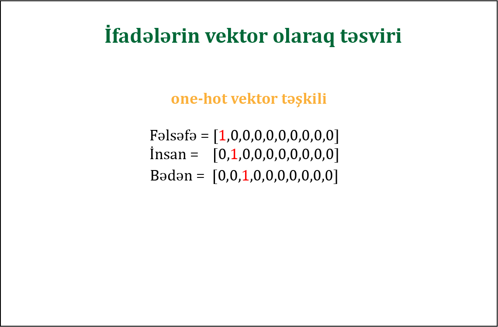
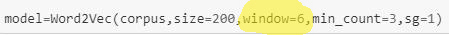
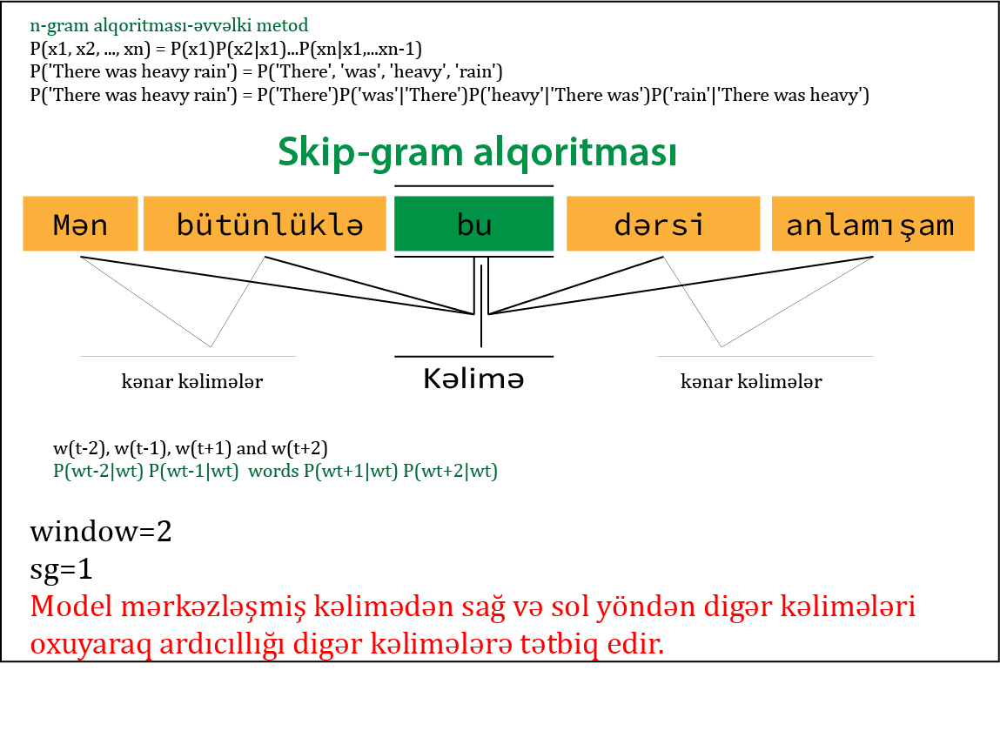

# word2vec

----------

# Natural Language Processing(NLP) #

Təsnifatına görə dilləri iki qrupa bölsək:
> Təbii dillər 
və Sünii dillər

Gündəlik həyatımızda istifadə etdiyimiz dillər(İngilis,İspan,Azərbaycan,Rus dilləri) təbii dil olaraq adlanır.Bir-birimizə fikrimizi dil vasitəsilə çatdırırıq.Süni dillərə misal olaraq Türing maşınları üzərində çalışan xüsusi dillərdir(0 və 1,Pascal,Fortan,C/C++,Python,Java və s).Bəhs etdiyimiz "təbii dil işləmə(NLP)" bir dildəki cümləni oxuması və başqa bir dildə uyğun bir cümləyə uyğunluğunun təşkili maşın çevirmələridir.NLP -nin çalışma prinspi,təbii bir dil üzərində-daxilində ifadə olunan hər bir kəlimə-xarakterlərdən və ya bayt array-dən təşkil olunan modellərdir([https://www.deeplearningbook.org/](https://www.deeplearningbook.org/ "Deep Learning book"))
> Bir dil modeli,təbii dildə token vektoru üzərində təxmini dağılım təyin edir.Modelin hazırlanmasına bağlı olaraq,tokenlər - bir kəlimə,xarakter və ya bayt ola bilirlər.İlk olaraq dil modelləri n-gram adlandırılan sabit uzunluqdakı token vektorlarının modellərindən təşkil olunmuşdur(Bundan başqa skip-gram,cbow).

----------
> 
İfadələri rəqəmsal ifadə etdiyimiz zaman həmin kəlimələr üzərində riyazi əməliyyatlar aparmaq daha ## rahatdır.
Hər bir ifadəni one-hot vektor olaraq təsvir etsək 

  

Yuxarıdakı rəsimdə göstərilən ilk Fəlsəfə ifadəsi vektor olaraq uyğunluq indeksi -0,
 İnsan kəliməsi vektor daxilində birinci indeksdə dayanır.

Yuxarıdakı təsvirə əsaslansaq,ifadə sayı çoxaldıqca kəlimələri tanımlamaq çətinləşəcəq.Bunun üçün alternativ olaraq one-hot vektoru deyil,hər bir kəliməni vektor ilə təşkil edib(word2vec) hər bir vektor kəlimə üçün 0 və 1 arasında həqiqi ədəd tipində göstərəcəyik.

Embedding Matrix(word vector,word embedding)

> Insan([ 3.26409712e-02, -1.11495465e-01, -1.09878801e-01, -1.61514040e-02,
        6.24946095e-02, -5.53264767e-02,  1.88343860e-02, -3.00338143e-03,
       -1.54164627e-01, -6.94016367e-02,  1.75558016e-01,  8.69417936e-02..................] size=200

>Fəlsəfə ([ 0.03672487, -0.11063578, -0.09298438, -0.01961881,  0.05883814,
       -0.05005358,  0.01460049, -0.00244978, -0.15134725, -0.07507091,
        0.1764792 ,  0.08856005, -0.11544561,  0.13122901,  0.02955697,
       -0.08000021, -0.10689594,  0.00531672, -0.07659401, -0.01527801,
       -0.27507988,  0.04865298,  0.01300979, -0.1417728 , -0.03595459.........................] size=200

----------

Vektorları təşkil etmək ,üçün cümlə daxilində seçilən söz(ifadə) ətrafındakı sözlərlə əlaqəsini təyin edərək hazırlayacağıq.(Qeyd edimki sağ və sol kəlimə uyğunluğunu təsadüfi deyil,window-parametri ilə biz seçirik)

  

# Korpusun haz?rlan?lmas? #
Az sayda k?lim?l?rd?n t?skil olun korpus,biz? ist?diyimiz modelin n?tic?sini verm?y?c?k.Bunun ucun daha prespektiv wiki layih?l?ri kimi k?lim?l?r toplusu olan datalara ehtiyyac?m?z var.Yuxar?da qeyd olunan korpus sad?c? numun? ucun haz?rlan?lm?sd?r.N?tic? etibar? il? k?lim?y? ?n yax?n dig?r k?lim?l?rin bir nec?si uygunluq t?skil etmisdir.

word2vec vasit?sil? k?lim? vektoru haz?rlamaq  ucun iki f?rqli alqoritmd?n istifad? olunur
> skip-gram
> cbow alqoritmas?

Istifad? etdiyimiz kodlarda skip-gram alqoritmas?na n?z?r yetir?k.(Qeyd vektorlar?n haz?rlan?lmas?nda alqoritman? qeyd etm?s?niz normal halda cbow-alqrt ?lav? olunur-DEFAULT:CBOW)

  

----------
`$ git clone https://github.com/RashadGarayev/word2vec`

`$ cd word2vec`

`$ pip install -r requirements.txt`

